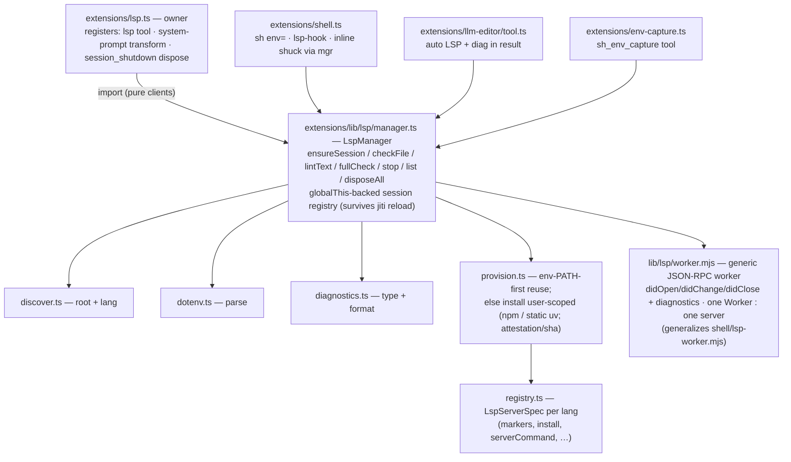

# cpi LSP subsystem — design outline

A neovim-LSP-inspired language-server layer for cpi. One persistent LSP
server process per `(language, project_root)`, driven over stdio JSON-RPC by
a dedicated Worker thread, exposing diagnostics to the `lsp` tool, the
`llm_editor` tool, and shell editing commands. Shuck is hoisted in as a
first-class language server; the shell tool's inline shuck lint is kept.

---

## 1. Goals / non-goals

Goals:
- `lsp` tool: `list_sessions | start | stop | check` over a per-project set
  of language servers.
- Project auto-discovery from a file/dir upward to root markers.
- Provision servers **user-scoped** into the agent cache
  (`getAgentDir()/lsp_envs/<lang>`) via `npm` (typescript) or a **downloaded
  static `uv`** (python). If the server binary is already resolvable in the
  merged spawn env (incl. `env=` dotenv), use that instead of installing.
  Shuck is reused from the global agent cache.
- `check` output obeys the shell tool's output limits (max-N-lines + 32K),
  overflow → log file (same truncation pipeline as `sh`).
- Shell tool spots AST-level *editing commands* (`cat >`, `sed -i`, `tee`,
  `>`/`>>` redirects onto source files) and LSP-checks the destination; if no
  session is up, emits a one-time warning guiding the model to `lsp start`.
- `llm_editor` create/edit always instantiates (auto-starts) the matching LSP,
  reports the discovered project path, hints the model it can restart the LSP
  with a correct `env=`, and returns diagnostics in the tool result. Install is
  bounded and degrades non-blocking so an edit never stalls on provisioning.
- `env=` dotenv param on `sh` and `sh_repeat_until`.
- `sh_env_capture` helper: capture current env (optionally after running a
  command) into a session-scoped dotenv file, reloadable via `env=` on
  `sh`/`lsp`/`sh_repeat_until`.

Non-goals (v1):
- Hover / go-to-definition / rename / code-action / formatting. Diagnostics +
  project check only (the neovim `vim.diagnostic` + `vim.lsp.buf` subset we
  need).
- Multi-file workspace sessions beyond one root per language.
- LSP-driven auto-fix application.

---

## 2. Requirement traceability

| Requirement | Where |
| --- | --- |
| `lsp` tool commands `list_sessions\|start\|stop\|check` | §7 |
| `project_dir` (start/stop/check; check ⇒ full package) | §7.4, §6.5 |
| `file` (start/stop/check; project auto-discovered) | §6.1, §7 |
| `env=` dotenv for the LSP | §6.4, §7.3 |
| `lib/lsp/discover.ts` project auto-discovery (pyproject.toml, .git, …) | §6.1 |
| Install user-scoped (npm / static uv); reuse env-provided LSP | §6.6, §6.2 |
| `check` uses shell-tool output limits → logs | §7.4, §6.5 |
| Shell: spot editing commands via AST, LSP-check dest, warn if no session | §8 |
| `llm_editor`: always instantiate LSP (bounded + degrade), report project path + restart hint, return warnings | §9 |
| Guideline: `start` re-invokable to restart (reload dot_env) | §7.3, §11 |
| `env=` on `sh` and `sh_repeat_until` | §8.1 |
| `sh_env_capture` tool, session-scoped dotenv, agent aware | §10 |
| Supported: typescript-language-server, pyrefly, hoist shuck | §6.6, §6.2 |
| Shell retains inline shuck check semantics | §8.3 |

The `file` param description mentions "start/end/lint"; this maps to
**start/stop/check** (`end`→`stop`, `lint`→`check`). The canonical command set
is `list_sessions|start|stop|check`.

---

## 3. Neovim-LSP conceptual mapping

| neovim | cpi |
| --- | --- |
| `vim.lsp.start({cmd, root_dir, name})` | `LspManager.ensureSession(language, root)` |
| client RPC loop (libuv, stdio JSON-RPC) | `lib/lsp/worker.mjs` (Content-Length framing), one Worker : one server |
| `vim.lsp.stop_client()` | `LspManager.stop(sessionId)` |
| `vim.lsp.get_clients()` | `lsp list_sessions` |
| buffer attach / `didOpen`/`didChange`/`didClose` | document tracking per file in the worker |
| `vim.diagnostic` (from `publishDiagnostics`) | diagnostics cache + `checkFile`/`lintText` |
| per-client event loop (isolated fault domain) | dedicated Worker thread per server (crash isolation) |

Differences from neovim:
- No TUI virtual text. Diagnostics surface in tool results / appended to `sh`
  output / one-time queued warnings.
- Sessions live process-lifetime on a `globalThis` slot (jiti-reload-safe),
  not per-buffer-attach-on-edit. Documents are opened on demand
  (`checkFile` opens→awaits→closes, mirroring the existing shuck synthetic-doc
  pattern in `shell/lsp-worker.mjs`).
- A **single owner extension** (`extensions/lsp.ts`) registers the `lsp` tool,
  the system-prompt transform, and the `session_shutdown` teardown — the cpi
  "one owner for shared plumbing" rule. Producers (`shell`, `llm_editor`)
  are pure clients of `lib/lsp/manager.ts`.

---

## 4. Architecture overview



Data flow: producer calls `LspManager.checkFile(absPath)` → manager resolves
`(language, root)` via `discover.ts` → `ensureSession` (resolve-or-install +
spawn worker if absent) → worker `didOpen` + awaits `publishDiagnostics` →
diagnostics returned → producer formats/appends.

---

## 5. Module layout

### New files

| File | Role | Src budget |
| --- | --- | --- |
| `extensions/lsp.ts` | Owner: registers `lsp` tool, system-prompt transform, `session_shutdown` teardown. | ~280 |
| `extensions/env-capture.ts` | Owner: registers `sh_env_capture` tool. | ~110 |
| `extensions/lib/lsp/manager.ts` | `LspManager`: globalThis state, `ensureSession`/`checkFile`/`lintText`/`fullCheck`/`stop`/`list`/`disposeAll`. Branch-heavy — mind the 355-AST limit. | ~300 |
| `extensions/lib/lsp/registry.ts` | `LspServerSpec` per language (markers, install spec, `serverCommand`, `languageId`, `initOptions`, `fullCheckCommand`). | ~120 |
| `extensions/lib/lsp/discover.ts` | `discoverProjectRoot(path, langHint)` + `languageByPath(path)`. | ~90 |
| `extensions/lib/lsp/dotenv.ts` | `parseDotEnv(path)`: bounded parser, no interpolation. | ~70 |
| `extensions/lib/lsp/diagnostics.ts` | `Diagnostic` type + `formatDiagnostics`. | ~60 |
| `extensions/lib/lsp/provision.ts` | `resolveBin(spec, env)`: env-PATH-first reuse, else install user-scoped (npm / static uv, attestation/sha verify). Branch-heavy — mind the 355-AST limit. | ~200 |
| `extensions/lib/lsp/worker.mjs` | Generic JSON-RPC worker (parameterized server). | ~150 |
| `extensions/shell/edit-detect.ts` | `detectEdits(astNode)`: editing commands → `EditTarget[]`. | ~110 |
| `extensions/shell/lsp-hook.ts` | `postRunLspCheck(edits, ctx)`: post-run LSP check / no-session warning orchestration (pure leaf). Extracted to keep `shell.ts` under the 397-line limit. | ~90 |

All under the 397-line / 355-AST hard limit. The `lib/lsp/*` and `shell/*`
helper modules are pure node (no pi/tui imports), mirroring `shell/exec.ts`
and `shell/tools.ts`; only the owner extensions import `ExtensionAPI`.

### Modified files

| File | Change |
| --- | --- |
| `extensions/shell.ts` | `env?` on `sh` schema; call `buildShellEnvWithDotenv` + `postRunLspCheck` (one-liners, **not inlined** — `shell.ts` sits at 396/397 src lines); drop `disposeLspClient()` import + call; +1 guideline line. Net ≈ +2 src lines → ≤390. |
| `extensions/shell/tools.ts` | Add `buildShellEnvWithDotenv(sm, envPath?)` = `buildShellEnv` + `parseDotEnv` merge (keeps the pure-leaf invariant; `tools.ts` has headroom). |
| `extensions/shell/repeat.ts` | `env?` on `sh_repeat_until` schema; wire `ctx.sessionManager` (execute currently types `_ctx` unused and builds env from bare `getToolEnv()`) → base on `buildShellEnvWithDotenv(ctx?.sessionManager, env)`. |
| `extensions/shell/lint.ts` | Rewrite as thin client: `lintCommand` → `LspManager.lintText("shell", cmd)`. Keep `ShuckDiagnostic`/`formatDiagnostics`/`disposeLspClient` signatures (latter → no-op) so `shell.ts` stays structurally stable. |
| `extensions/llm-editor/tool.ts` | After `create`/`edit` write: `ensureSession` + `checkFile`; append `<lsp project=… state=…>` + `<diagnostics>` to result XML; include restart-env hint; non-blocking degrade on install failure. |
| `extensions/llm-editor/text.toml` | Messages for diagnostics / install-failed block (optional prose). |
| `extensions/lib/config.ts` | `LspConfig` + `loadLspConfig`. |
| `cpi-config.default.json` | `lsp` section. |
| `extensions/shell/lsp-worker.mjs` | **Deleted** — superseded by `lib/lsp/worker.mjs`; shuck inline lint moves to the generic worker via the manager. Removed only after a parity test (§15). |

`extensions/core.ts` is **unchanged**: the lsp owner self-registers its tool,
transform, and shutdown handler; the no-session warning reuses `queueMessage`
whose drains core already owns. No new shared plumbing needs a core owner.

---

## 6. `lib/lsp` subsystem

### 6.1 Project auto-discovery (`discover.ts`)

```ts
function discoverProjectRoot(startPath: string, langHint?: Language): string | null;
function languageByPath(path: string): Language | null;   // by extension
```

- Resolve `startPath`: file → `dirname`; dir → itself. Absolute via `resolveCwdPath`.
- Walk upward (`dirname` loop) until root; return the **nearest** dir
  containing a marker. Bound: max depth 32, stop at `HOME` or `/`.
- Marker priority: language-specific first (TS: `tsconfig.json`,
  `package.json`, `jsconfig.json`; Python: `pyproject.toml`, `setup.py`,
  `setup.cfg`, `uv.lock`, `requirements.txt`, `Pipfile`, `.python-version`;
  Shell: `.git`), then generic (`.git`, `.hg`).
- `langHint` (from the file extension) biases which marker wins when several
  dirs match at the same level. If none found, return the file's `dirname`
  as a fallback root (so a lone file still gets a session).
- No recursion; explicit depth cap; pure function.

### 6.2 Language registry (`registry.ts`)

```ts
type Language = "typescript" | "python" | "shell";

interface FullCheck { cmd: string; args: string[]; cwd?: string }

interface LspServerSpec {
  language: Language;
  extensions: string[];                 // [".ts",".tsx"] / [".py"] / [".sh",".bash"]
  markers: string[];                    // for discovery
  languageId: (path: string) => string; // "typescript"|"typescriptreact"|"python"|"bash"
  install: { method: "npm" | "uv" | "reuse" };
  binName: string;                       // "typescript-language-server" | "pyrefly" | "shuck"
  serverCommand: (bin: string, root: string) => { cmd: string; args: string[] };
  initOptions?: unknown;
  supportsFullPackageCheck: boolean;
  fullCheckCommand?: (bin: string, root: string) => FullCheck;
}
```

- **typescript**: `install.method = "npm"`; `binName =
  "typescript-language-server"`; `serverCommand(bin)` → `${bin} --stdio`;
  `languageId` maps `.tsx`→`typescriptreact`. `supportsFullPackageCheck =
  true`; `fullCheckCommand` → `{ cmd: <tscBin>, args: ["--noEmit","-p",root] }`
  (tsc resolved from the env's `node_modules/.bin`).
- **python**: `install.method = "uv"`; `binName = "pyrefly"`; `serverCommand`
  → `${bin} lsp`; `supportsFullPackageCheck = true`; `fullCheckCommand` →
  `{ cmd: bin, args: ["check"], cwd: root }`. `pyrefly check` with no file
  args is project mode from cwd; passing `<root>` as a file arg would be
  per-file mode. Full-project therefore runs `pyrefly check` with `cwd=root`,
  not `pyrefly check <root>`.
- **shell (shuck)**: `install.method = "reuse"` — `binName = "shuck"`;
  resolution reuses `getShuckBinPath()` from `shell/tools.ts` (global agent
  cache); if absent, `ensureShellTools()` downloads it (existing path).
  `serverCommand` → `${bin} server --isolated` (`--isolated` = skip workspace
  discovery, single-file semantics — just a `serverCommand` arg);
  `languageId` → `"bash"`; `supportsFullPackageCheck = false` (shuck lints
  commands/files, no package concept).

Version pins (typescript-language-server, typescript, pyrefly, uv) live in
config (§12); `registry.ts` reads them via `loadLspConfig`.

### 6.3 `LspManager` (`manager.ts`)

State on a `globalThis` slot (`__cpiLsp`), shared across jiti loads — same
pattern as `lib/footer.ts`, `lib/session-hold.ts` (slot confirmed free, §14):

```ts
interface LspSession {
  id: string;                 // `${language}:${projectRoot}`
  language: Language;
  projectRoot: string;
  envPath?: string;           // dotenv last loaded (for restart-with-new-env)
  bin: string;                // resolved server binary (env-provided or installed)
  worker: Worker;
  ready: Promise<boolean>;
  state: "starting" | "ready" | "dead" | "install-failed";
}
interface LspState { sessions: Map<string, LspSession>; warned: Set<string>; }
```

API (all async, all pure-node — no pi imports):

```ts
ensureSession(language, root, envPath?): Promise<LspSession>;
   // merge spawn env (getToolEnv + dotenv) → provision.resolveBin (env-PATH-first
   //   else install, bounded by installTimeoutMs) → spawn worker → initialize handshake.
   // If session exists and envPath differs (or force): stop + restart.
   // Resolves even if install failed (state="install-failed"); never throws to a
   //   producer — the caller degrades (§9).
checkFile(absPath): Promise<Diagnostic[]>;     // didOpen real file → await diag → didClose
lintText(language, text): Promise<Diagnostic[]>; // synthetic /tmp doc (shuck inline, editor pre-write)
fullCheck(root, language): Promise<{ text: string; logPath?: string }>; // CLI checker, shell-style truncation
stop(sessionId | by file/project_dir): Promise<void>;
list(): SessionInfo[];
disposeAll(): Promise<void>;   // idempotent/reentrant (§13); shutdown → exit every server; kill on timeout
```

- `ensureSession` is the single spawn point. Idempotent on `(language,root)`.
  Re-invocation with a new `envPath` (or `force`) **restarts** — this is the
  "reload dot_env" path (§7.3).
- `checkFile` opens the file by `file://` URI, awaits `publishDiagnostics`
  (bounded by `lintTimeoutMs`), closes. Reuses the shuck synthetic-doc wait
  pattern generalized.
- `lintText` keeps the shuck inline path: synthetic `file:///tmp/cpi-lsp-<n>.sh`,
  no project root — identical semantics to today.
- `fullCheck` spawns the language CLI (`tsc --noEmit -p <root>` / `pyrefly
  check` with `cwd=root`), captures stdout+stderr, runs it through
  `buildOutputText` (re-exported from `@earendil-works/pi-coding-agent`) with
  `checkMaxLines`/`checkMaxBytes` → overflow persisted to a log file under the
  session dir. Same pipeline as `sh`.
- Worker path resolved via `import.meta.url` (sibling `worker.mjs`), exactly
  like `shell/lint.ts` resolves `shell/lsp-worker.mjs` today.

### 6.4 `dotenv.ts`

```ts
function parseDotEnv(path: string): Record<string, string>;
```

- Lines: skip blank / `#`-comment; strip optional `export ` prefix; split on
  first `=`; strip surrounding `"`/`'`; **no** `${VAR}` interpolation
  (deterministic, TigerStyle "minimize dependencies").
- Explicit limits: max file 256 KiB, max 4096 keys, max key/value 32 KiB.
- Shared by `sh env=`, `sh_repeat_until env=`, `lsp env=`, server spawn env,
  and `sh_env_capture` (write side is plain `KEY=value`).

### 6.5 `diagnostics.ts`

```ts
interface Diagnostic {
  severity: "error" | "warning" | "hint" | "info";
  code?: string;
  message: string;
  source: string;        // "pyrefly" | "tsserver" | "shuck"
  file: string;          // absolute path ("" for synthetic inline docs)
  startLine: number; startCol: number;
  endLine: number; endCol: number;
}
function formatDiagnostics(d: Diagnostic[], opts?): string; // "Lr:c severity[source] msg  (file)"
```

`ShuckDiagnostic` (in `shell/lint.ts`) becomes a type alias / adapter over
`Diagnostic` so `shell.ts` formatting stays untouched.

### 6.6 Provisioning (`provision.ts`)

```ts
function resolveBin(spec: LspServerSpec, env: NodeJS.ProcessEnv): Promise<{ bin: string; envDir?: string; source: "env" | "installed" }>;
```

Resolution order (applies uniformly to every language — "if the env contains
the LSP, use that instead"):

1. **Env-PATH-first reuse.** `which(spec.binName)` against the merged spawn env
   (`getToolEnv()` + `parseDotEnv(envPath)`). If found → return it, **no
   install**. A project's own toolchain (a venv with `pyrefly`, an `npx`-style
   install, or a user `PATH` export) wins. For shell/shuck this also reuses
   the global cache via `getShuckBinPath()`.
2. **Install user-scoped.** Otherwise install into the agent cache
   (`getAgentDir()/lsp_envs/<lang>` — shared across projects, so two TS
  projects share one `typescript-language-server`). Idempotent +
  version-pinned: if `bin` exists, verify `--version` output matches the
  pinned version; on mismatch or absence, (re)install. So a config pin bump
  re-provisions instead of reusing a stale binary. Bounded by `installTimeoutMs`
   (default 60s, §12); on timeout/failure the session enters
   `state="install-failed"` and `ensureSession` resolves (non-blocking, §9/§13).
3. Return `bin` (resolved path) + `envDir` + `source`. The caller prepends
   `envDir/bin` (or `node_modules/.bin`) to `PATH` so the server can spawn
   tooling (tsserver/pyrefly finding their own bits).

Per-language install:

- **typescript** (`npm`; pi runs under **node**, `npm` on PATH): write a
  minimal `package.json` into `envDir`, then
  `npm install --prefix <envDir> typescript-language-server@<ver>
  typescript@<tsVer>`. Bin:
  `<envDir>/node_modules/.bin/typescript-language-server`. `tsc` for full
  check resolves from the same `node_modules/.bin`. Bare `npm` is used (not
  `process.execPath`+npm-cli.js, which is fragile across nvm/volta/homebrew;
  not `bun install` — pi is node and the server is pure-JS, so no ABI concern).
- **python** (`uv`, downloaded static): download a **static `uv`** binary
  (platform-specific musl release from `astral-sh/uv`) into
  `getAgentDir()/cache/uv/bin/uv` — same download pattern as `shell/tools.ts`.
  **Verification**: uv publishes **no minisign**; use **GitHub Artifact
  Attestation** as primary (`gh attestation verify <bin> --repo astral-sh/uv`
  — keyless Sigstore, separate trust store) and **sha256** (`<asset>.sha256`,
  always present, zero deps) as fallback when `gh` is unavailable or the
  attestation is absent. Never minisign for uv (the existing `lib/minisig.ts`
  is only for the tree-sitter wasm, whose `bobcao3/cpi` releases do publish
  minisign). Then `uv venv <envDir>` + `uv pip install --python
  <envDir>/bin/python pyrefly@<ver>`. Bin: `<envDir>/bin/pyrefly`. **uv is
  never assumed on PATH** — cpi ships its own.
- **shell (reuse)**: `getShuckBinPath()`; if missing, `await ensureShellTools()`
  (existing installer). No envDir.

Server spawn env: `{ ...getToolEnv(), ...parseDotEnv(envPath) }` with the
resolved bin's dir prepended to `PATH`.

> The *install* is user-scoped (one binary per language, shared). The *server
> process* is still per `(language, root)` (separate worker per root), so each
> project gets its own initialized server with its own rootUri.

---

## 7. `lsp` tool (`extensions/lsp.ts`)

### 7.1 Schema

```ts
Type.Object({
  command: Type.Union([
    Type.Literal("list_sessions"),
    Type.Literal("start"),
    Type.Literal("stop"),
    Type.Literal("check"),
  ]),
  project_dir: Type.Optional(Type.String({ description: "Project root. For check: full package check." })),
  file:       Type.Optional(Type.String({ description: "File path; project auto-discovered. start/stop/check." })),
  env:        Type.Optional(Type.String({ description: "Path to a .env file to load for the server (restart on change)." })),
})
```

### 7.2 Commands

- **`list_sessions`** — table of `id | language | root | bin | env | state`.
  No truncation.
- **`start`** — resolve `(language, root)`:
  - `file` → `languageByPath(file)` + `discoverProjectRoot(file, lang)`.
  - `project_dir` → `languageByPath` from markers in dir (or require `file` to
    disambiguate if multiple languages present).
  - both → `file`'s language wins, `root = project_dir`.
  - none → error.
  - `ensureSession(language, root, env)` → if a session exists and `env`
    differs (or same `env` but `force`), **restart**. Return `id` + `state` +
    resolved `bin` (`source: env-provided | installed`) + any install error.
- **`stop`** — resolve session by `file` (discover) or `project_dir`; `stop()`.
- **`check`** —
  - `file` (only): `ensureSession` (auto-start — the model explicitly asked)
    + `checkFile(abs)` → formatted diagnostics, bounded. If the session is
    `install-failed`, return the install error + the hint (no diagnostics).
  - `project_dir` (or `file`→root): **full package check** via
    `fullCheck(root, language)` (CLI checker), shell-style truncation → log.
  - both: `project_dir` wins (full package).
  - neither: error.

### 7.3 Restart / dot_env reload

`start` is **re-invokable**: calling it again with a new `env=` stops the old
worker and starts a new one with the merged env. Calling with the same args is
a no-op (session already `ready`). This is the mechanism for loading a new
dot_env — e.g. after `sh_env_capture` of a venv. The guideline (§11) calls it
out; the `llm_editor` result also hints it (§9).

### 7.4 Output limits

`check` reuses `buildOutputText` from `@earendil-works/pi-coding-agent` with
`truncation = { mode: "tail", maxLines: checkMaxLines }` and
`previewMaxBytes = checkMaxBytes` — the exact pipeline `sh` uses. Defaults
match `sh` (500 lines, 32 KiB). Overflow → log file under the session dir,
path returned to the model (same `fullOutputPath` convention).

---

## 8. Shell integration

### 8.1 `env=` on `sh` and `sh_repeat_until`

`sh` schema gains `env?: path`. In `execute`, env built via the new
`buildShellEnvWithDotenv(ctx?.sessionManager, params.env)` in `shell/tools.ts`
(= `buildShellEnv` then merge `parseDotEnv(resolveCwdPath(env))`). Merge order:
process env ← tool PATH bins ← `PI_SESSION*` ← dotenv wins.

`sh_repeat_until` gets the same `env?`. **Wiring**: `repeat.ts` currently
types `execute`'s ctx as `_ctx` (unused) and builds its env from bare
`getToolEnv()` (no `PI_SESSION`/`PI_SESSION_DIR`). Adding `env=` requires
switching the base to `buildShellEnvWithDotenv(ctx?.sessionManager, env)` —
i.e. `repeat.ts` must use `ctx.sessionManager`, not just merge a dotenv over
`getToolEnv()`.

### 8.2 Editing-command detection (`shell/edit-detect.ts`)

Pure AST function, same shape as `shell/cd-targets.ts`
(`extractCdTargets` → `surfaceCdAgents`):

```ts
interface EditTarget { path: string; command: string; row: number; column: number; }
function detectEdits(root: Node | null): EditTarget[];
```

Detected patterns (conservative — destination must have a known source
extension, else ignored):
- `file_redirect` with operator `>` / `>>` / `>|` / `&>` on any content
  producer (`echo`, `printf`, `cat`, heredoc/herestring bodies, pipelines).
- `sed -i` / `sed --in-place`: file args (non-flag).
- `tee` / `tee -a`: file args.
- `cp` / `mv`: destination = last arg (only if it has a known extension).
- `cat <<EOF > file`, `cat > file`.

Returns resolved absolute paths. Reuses `JsonNode` from `lib/tree-sitter.ts`
and the `commands(root)` / `cmdArgs` helpers already in `shell/rules.ts`.

### 8.3 Shell retains inline shuck check semantics

`shell/lint.ts` is rewritten to call `LspManager.lintText("shell", cmd)` — the
manager owns one `shell:inline` shuck session (rootUri=null, synthetic /tmp
doc). **Semantics preserved**: same blocking-on-error, same warning surfacing,
same 10s timeout, same `ShuckDiagnostic`/`formatDiagnostics` shapes. Shuck
uses stock LSP over stdio (the `lsp-server` crate); `--isolated` is just a
`serverCommand` arg and `languageId:"bash"` a registry field — so the generic
`lib/lsp/worker.mjs` drives it identically (§15). The dedicated
`shell/lsp-worker.mjs` is deleted after a parity test. `shell.ts` keeps
`lintCommand`/`formatDiagnostics` imports; the `disposeLspClient()` call in
`session_shutdown` is dropped (the lsp owner disposes all sessions).

### 8.4 Post-run LSP check on edited files

Orchestration lives in **`shell/lsp-hook.ts`** (`postRunLspCheck(edits, ctx) →
{ appendedText?, warning? }`), a pure leaf mirroring `shell/cd-targets.ts`
(detect→surface split). `shell.ts` calls it with one line after a **completed**
(non-backgrounded, non-blocked) `runShell` — **not inlined**, because
`shell.ts` sits at 396/397 source lines (§15). Logic:

```ts
const edits = availability.treeSitter ? detectEdits(parse.node) : [];
const hook = await postRunLspCheck(edits, ctx);   // shell/lsp-hook.ts
if (hook.appendedText) text += hook.appendedText;  // formatted diagnostics
if (hook.warning) queueMessage({ ...hook.warning, deliverAs: "afterToolResult" });
```

Inside `postRunLspCheck`, per `EditTarget`:
- `lang = languageByPath(t.path)`; skip if null.
- `root = discoverProjectRoot(t.path, lang)`.
- `sess = manager.findSession(lang, root)`.
  - if `sess` && `sess.state === "ready"`: `diags = await manager.checkFile(t.path)` →
    formatted diagnostics appended to the sh result.
  - else: one-time warning (dedup via `LspState.warned` keyed `${lang}:${root}`,
    delivered via `queueMessage({ deliverAs: "afterToolResult" })`) +
    inline note "(no LSP for `<path>`; run `lsp start file=<path>` to enable auto-lint)".
- Backgrounded commands: skip check (file may be mid-write); note
  "edit pending; LSP check skipped (command running)".
- `warned` is **advisory-dedup only** — it never gates `checkFile` (§14).
- Diagnostics are **advisory, non-blocking**: the shell command already ran;
  we report, not reject. (Distinct from the pre-run shuck lint which blocks.)

---

## 9. `llm_editor` integration (`llm-editor/tool.ts`)

After a successful `create` or `edit` write (not `view` — read-only):
```ts
const lang = languageByPath(abs);
if (lang) {
  const root = discoverProjectRoot(abs, lang);
  const sess = await manager.ensureSession(lang, root);   // auto-start, bounded
  let lspField: string;
  if (sess.state === "install-failed") {
    lspField = `<lsp project="${root}" state="install-failed">run 'lsp start file=${params.path}' to provision</lsp>`;
  } else {
    const diags = await manager.checkFile(abs);
    lspField = `<lsp project="${root}" bin="${sess.bin}">started</lsp>` +
               `<diagnostics>${formatDiagnostics(diags) || "none"}</diagnostics>`;
    // + hint: "LSP auto-started for <root>. If the env is wrong (wrong venv /
    //   missing toolchain), run `lsp start file=<path> env=<dotenv>` to restart."
  }
  // append lspField + hint to the result XML
}
```
- "Always instantiate an LSP" ⇒ `ensureSession` is always invoked on
  create/edit. Reused thereafter. Scope: **create/edit** (mutations); `view`
  is excluded (read-only, no `writeFile` — §15).
- **Project path reported**: the result includes `<lsp project="<root>">` so
  the model knows which root the server indexed (matters when discovery picks
  an unexpected parent monorepo).
- **Restart hint**: the result tells the model it can `lsp start` (restart)
  with a proper `env=` if the server booted against the wrong env (wrong
  Python venv, missing `NODE_PATH`). Pairs with `sh_env_capture` (§10).
- **Bounded + non-blocking degrade**: `ensureSession`'s install step is
  bounded by `installTimeoutMs` (60s). On install timeout/failure the session
  is `install-failed`; the **edit still returns success** with a
  `<lsp state="install-failed">` hint — the model is told to run `lsp start`
  to provision. The edit never blocks for minutes and never fails because of
  provisioning. (`startupTimeoutMs`=30s bounds only the handshake after
  install; install has its own bound.)
- Unsupported languages (`.md`, `.json`, …) ⇒ skip silently, no diagnostics
  field.
- Diagnostics are **advisory**: the edit is already applied; we report in the
  result XML, not block. (Editor is the sanctioned path; the model already
  wrote the file.)
- The editor's existing model-delegation latency hides the server *boot*; the one-time
  install is bounded + degrades.

Result extension: add `<lsp project=… bin=… state=…>` + `<diagnostics>` fields
to `resultXml`.

---

## 10. `sh_env_capture` tool (`extensions/env-capture.ts`)

Sole owner of one tool. Schema:
```ts
Type.Object({
  command: Type.Optional(Type.String({ description: "Optional bash to run before capturing (e.g. 'source .venv/bin/activate'). Omit = capture current process env." })),
  label:   Type.Optional(Type.String({ description: "Optional name for the dotenv file" })),
})
```
Behavior:
- Run `command` (if given) via `bash -lc '<cmd> && env'` else `env`, inheriting
  `buildShellEnv`. Parse `KEY=VALUE` lines.
- Write to `<sessionDir>/env-captures/<label-or-shortSha>.env`. `sessionDir =
  ctx.sessionManager.getSessionDir()`; if undefined (ephemeral `--no-session`
  parent) fall back to `getAgentDir()/env-captures/`. `mkdir -p`.
- Result returns: the **path**, the **count**, and a ready snippet:
  `env=<path>` usable on `sh` / `lsp` / `sh_repeat_until`.
- Explicit limits: max 4096 keys; values truncated to 32 KiB on write.

"Make agent aware": the tool's `promptGuidelines` + the lsp system-prompt
transform (§11) describe the capture→reload flow. Env contents are written to
a file and referenced by path; they are not echoed into the conversation, so
no redaction is needed.

---

## 11. Guidelines / system prompt

`extensions/lsp.ts` registers a system-prompt transform (id `lsp-behavior`,
order 150) using the strip-then-append pattern from `llm-editor/index.ts`
(reload-safe, dedup). Block documents:
- Supported languages + that `llm_editor` create/edit auto-lints, reports the
  project root, and returns diagnostics in the result.
- Shell editing commands (`cat >`, `sed -i`, `tee`, `>` redirects) trigger an
  LSP check when a session is up; otherwise a one-time warning tells the
  model to run `lsp start file=<path>` (or use `llm_editor`) to enable
  auto-lint.
- `start` is **re-invokable to restart** — e.g. to load a new dot_env
  (`lsp start file=… env=new.env`), e.g. after capturing a venv env.
- An env-provided LSP (binary already on the merged env's `PATH`, incl.
  `env=` dotenv) is used as-is instead of installing.
- `sh_env_capture` captures env (optionally after a `source`/activate) into a
  session-scoped dotenv; reload it via `env=` on `sh` / `lsp` /
  `sh_repeat_until`.

Per-tool `promptGuidelines`:
- `lsp`: command semantics, auto-start-on-check, restart-for-env,
  full-package-check-on-project_dir, output limits → logs, env-provided reuse.
- `sh_env_capture`: capture→reload.
- `sh`: +1 line — "Editing commands (`cat >`, `sed -i`, …) trigger LSP
  auto-lint when a session is up; else run `lsp start`."
- `llm_editor`: +1 line — "create/edit returns `<lsp project=…>` +
  `<diagnostics>` from the project's LSP; restart with `env=` if the env is
  wrong."

---

## 12. Config (`cpi-config.default.json` + `lib/config.ts`)

```json
"lsp": {
  "checkMaxLines": 500,
  "checkMaxBytes": 32768,
  "startupTimeoutMs": 30000,
  "lintTimeoutMs": 10000,
  "installTimeoutMs": 60000,
  "discoveryMaxDepth": 32,
  "servers": {
    "typescript": { "package": "typescript-language-server", "version": "5.3.0", "tsVersion": "6.0.3" },
    "python":     { "package": "pyrefly", "version": "1.0.0" },
    "shell":      { "enabled": true }
  },
  "tools": {
    "uv":         { "version": "0.11.23", "repo": "astral-sh/uv", "verify": "attestation-then-sha256" }
  }
}
```
`loadLspConfig(cwd)` deep-merged like the other sections; numeric fields
clamped via the existing `intInRange` helper. `registry.ts`/`provision.ts`
read pins from it. `tools.uv.version` pins the downloaded static uv binary;
`tools.uv.verify` records the attestation-primary/sha256-fallback policy. The
`tools` object holds provisioner binaries cpi downloads (uv); `npm` is assumed
on PATH so is not pinned. All version pins are exact (no ranges); a pin bump
re-provisions the next session via the version-match check in §6.6, and the
typescript `version`+`tsVersion` pair is verified together at provision time.

---

## 13. Fault model & explicit limits (TigerStyle)

- **Explicit limits**: `startupTimeoutMs` 30s (handshake), `installTimeoutMs`
  60s (provision), `lintTimeoutMs` 10s, max 64 open docs/session, 16 MiB
  worker recv buffer, discovery depth 32, dotenv 256 KiB / 4096 keys,
  `checkMaxLines` 500 / `checkMaxBytes` 32 KiB, max 200 diagnostics formatted.
- **Assertions**: worker `ready` before posting; `Content-Length` parse;
  session-id uniqueness; `languageByPath` non-null before `ensureSession` for
  a file path; resolved `bin` exists before spawn.
- **Fault model**: worker crash / server exit → session `dead`, removed from
  registry, pending `lintText` resolves `[]`, pending `checkFile` rejects
  (surfaced as an error string). Next `ensureSession` re-spawns. One server's
  crash never affects another (1:1 worker isolation). Server stderr → debug
  log. Install timeout/failure → `state="install-failed"`; `ensureSession`
  **resolves** (does not throw) so producers degrade (§9) — the edit/check
  still returns, with a hint. Env-provided reuse is attempted first so a
  broken install never blocks a project that already has the toolchain.
- **`disposeAll` idempotent/reentrant**: reload re-registers the
  `session_shutdown` handler; first call drains the sessions map, later calls
  no-op (disposed → no-op). Pending requests resolve `[]` on dispose, same as
  crash.
- **Bounded loops**: discovery upward walk (depth cap); worker `onData`
  `for(;;)` breaks on incomplete frames and resets on buffer breach.
- **Minimize dependencies**: no new npm deps. `dotenv` hand-rolled
  (deterministic, no interpolation). `uv` is a downloaded static binary (no
  runtime dep on a system uv). Reuses `worker_threads`, `child_process`, the
  existing `tree-sitter` wasm, and `@earendil-works/pi-coding-agent`'s
  truncation utils.

---

## 14. Reload-safety / ownership

- `LspManager` state on `globalThis.__cpiLsp` (sessions map + warned set) —
  survives jiti reload, shared across module copies. **Slot confirmed free**:
  existing slots are `__cpiFooter`, `__cpiHold`, `__cpiSystemPrompt`,
  `__cpiPrependBeforeUser`, `__cpiPrependAfterTool`, `__cpiTranscriptRenderers`,
  `__cpiCwdState`, `__cpiCwdBoundary`, `__cpiCwdSeenAgents`, `__cpiAgentsSeen`,
  `__cpiPollGuard`, `__cpiProvider`, `__cpiTreeSitter`, `__cpiEditorModel`
  (notification.ts uses none). `__cpiLsp` collides with none. Workers stored in
  that state object survive reload too (real resource state, not a boolean
  dedup flag — the sound pattern from `AGENTS.md`).
- `extensions/lsp.ts` is the **sole owner**: registers the `lsp` tool +
  transform + `session_shutdown` handler unconditionally at load;
  `pi.registerTool`/`pi.on` are idempotent on the fresh instance, so a
  hot-reload re-registers atomically. No `globalThis` dedup boolean.
- Producers (`shell.ts`, `llm-editor/tool.ts`, `env-capture.ts`) only call
  `LspManager` methods — never spawn servers or register the tool.
- The no-session warning uses `queueMessage` (drains owned by `core.ts`); no
  new drain owner needed.
- `warned` Set is **advisory-dedup only** for the one-time warning; it never
  gates `checkFile` (§8.4 routes by `findSession`, not `warned`). Survives
  reload; never reset (harmless — once warned, the model has been told).
- `session_shutdown`: lsp owner calls `manager.disposeAll()` (idempotent,
  §13). `shell.ts` no longer calls `disposeLspClient()`. `env-captures/` are
  session-scoped and torn down with the session dir.
- Installs are user-scoped (`getAgentDir()/lsp_envs/<lang>` + `cache/uv`);
  they persist across sessions and are not torn down on `session_shutdown`
  (only running servers are). `getAgentDir()` is the same cache `shell/tools.ts`
  already uses for fd/rg/shuck.

---

## 15. Design decisions & rationale

1. **Command wording** — `file` "start/end/lint" maps to `start/stop/check`
   (`end`→`stop`, `lint`→`check`); `list_sessions` has no `file` analogue.
2. **File vs full-package check** — tsserver `publishDiagnostics` covers open
   documents only ("can't compile the whole project"); `tsc --noEmit -p
   <root>` is the full-project path. pyrefly ships both `pyrefly lsp` and
   `pyrefly check`; `pyrefly check` (no file args) is project mode from cwd.
   File diagnostics go via LSP; full-package via CLI (`tsc`, `pyrefly check`
   with `cwd=root`, not `pyrefly check <root>` which is per-file mode).
3. **npm invocation** — pi runs under node; `npm` is on PATH. Bare
   `npm install --prefix <envDir>` (not `process.execPath`+npm-cli.js, which
   is fragile across nvm/volta/homebrew; not `bun install` — pi is node and
   the server is pure-JS).
4. **Shuck unification** — shuck speaks stock LSP over stdio (`lsp-server`
   crate); `--isolated` + `languageId:"bash"` are registry fields, no
   out-of-protocol handling. Drive shuck via the generic `lib/lsp/worker.mjs`
   and delete `shell/lsp-worker.mjs`, gated on a parity test (identical
   inline-lint output before/after).
5. **Auto-start split** — `lsp check` is an explicit request → auto-start the
   server. Shell editing is incidental → warn, do not auto-start (avoids
   install+spawn latency on routine `sed -i`/`cat >`). Edits are
   advisory/non-blocking; the model opts in via `lsp start`/`check`.
6. **Editor scope** — `view` has no `writeFile` (read-only); auto-lint on view
   would harm read latency and adds install+spawn cost for low signal
   (pre-existing errors surface on the next create/edit or `lsp check`).
   LSP runs on **create/edit only**.
7. **uv verification** — uv publishes no minisign; only sha256 + GitHub
   Artifact Attestations (Sigstore keyless; not guaranteed on manual
   releases). Use **GitHub Artifact Attestation** primary
   (`gh attestation verify --repo astral-sh/uv`), **sha256** fallback. Never
   minisign for uv (minisign stays only for the tree-sitter wasm).

### Sizing & wiring decisions

- **`shell.ts` extraction** — `shell.ts` sits at 396/397 source lines (1
  headroom). Inlining `env=`, `detectEdits`, the post-run loop, and the warning
  would push it to ~414 (over). §8.4 orchestration is extracted into
  `shell/lsp-hook.ts` (`postRunLspCheck`); the `env=` merge moves into
  `buildShellEnvWithDotenv` in `shell/tools.ts`. `shell.ts` adds only ~2
  one-liners → ≤390. `manager.ts` (~300) and `provision.ts` (~200) are the
  branch-heavy modules kept under the 355-AST limit.
- **Install-bound degrade** — `llm_editor` auto-start could otherwise block on
  install (minutes of network). Install is bounded (`installTimeoutMs`=60s)
  and degrades non-blocking: the edit returns success with
  `<lsp state="install-failed">` (§9). "Always instantiate" means
  `ensureSession` is always invoked; it degrades rather than stalling.
- **`sh_repeat_until` ctx wiring** — `repeat.ts` builds env from
  `getToolEnv()` and types `ctx` as `_ctx` (unused). It is rewired to
  `buildShellEnvWithDotenv(ctx?.sessionManager, env)` (§8.1).
- **Ephemeral session fallback** — `getSessionDir()` is undefined for
  `--no-session` parents. `sh_env_capture` falls back to
  `getAgentDir()/env-captures/` (§10).
- **Atomic migration** — the `lint.ts` rewrite and the `shell.ts`
  `disposeLspClient` removal land together so `shell.ts` never imports a
  removed export.
