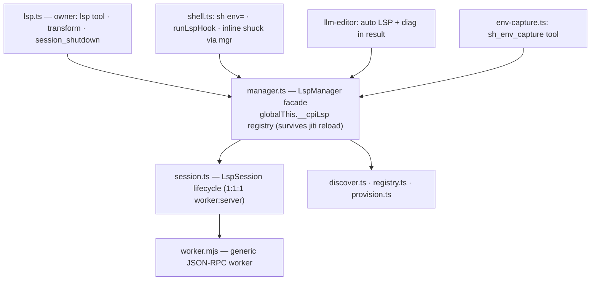

# cpi LSP subsystem — design

Colocated with the implementation in `extensions/lib/lsp/`. A
neovim-LSP-inspired layer: one persistent LSP server per `(language,
project_root)`, driven over stdio JSON-RPC by a dedicated Worker thread,
exposing diagnostics to the `lsp` tool, `llm_editor`, and shell editing
commands. Shuck is hoisted as a first-class server; the shell tool's inline
shuck lint is preserved (now routed through the same manager).

---

## 1. Goals / non-goals

Goals:
- `lsp` tool `list_sessions | start | stop | check` over per-project servers,
  with project auto-discovery from a file/dir upward to root markers.
- Provision servers **user-scoped** into the agent cache
  (`getAgentDir()/lsp_envs/<lang>`) via `npm` (typescript) or a **downloaded
  static `uv`** (python); reuse a server already resolvable in the merged spawn
  env (incl. `env=` dotenv) instead of installing. Shuck reused from the global
  agent cache.
- `check` returns per-file diagnostics (`didOpen` → await `publishDiagnostics`
  → `didClose`), bounded by `lintTimeoutMs`.
- Shell spots AST-level **editing commands** (`cat >`, `sed -i`, `tee`, `>`/`>>`
  redirects, `cp`/`mv`) and LSP-checks the destination when a session is up; else
  a one-time warning guiding the model to `lsp start`.
- `llm_editor` create/edit always instantiates the matching LSP, reports the
  project root, returns diagnostics in the result; install is bounded and
  degrades non-blocking so an edit never stalls on provisioning.
- `env=` dotenv on `sh`, `sh_repeat_until`, `lsp` (restart on change).
- `sh_env_capture`: capture current env (optionally after a command) into a
  session-scoped dotenv, reloadable via `env=`.

Non-goals (v1):
- Hover / go-to-definition / rename / code-action / formatting. Diagnostics only.
- Multi-file workspace sessions beyond one root per language.
- **Full-package / project-wide CLI checks** (`tsc --noEmit -p <root>`,
  `pyrefly check` over a whole root) — **deprecated**. `lsp check` is per-file
  diagnostics through the live LSP session only; the earlier `fullCheck` /
  `fullCheckCommand` / `supportsFullPackageCheck` design was cut, and
  `project_dir` on `check` is unused (`check` requires `file`).
- LSP-driven auto-fix application.

---

## 2. Architecture



Data flow: producer calls `checkFile(absPath)` → manager resolves `(language,
root)` via `discover.ts` → `ensureSession` (resolve-or-install + spawn worker if
absent) → worker `didOpen` + awaits `publishDiagnostics` → diagnostics returned
→ producer formats/appends. Engine modules, the dotenv parser, the output
truncator, and shell helpers are pure node (no pi/tui imports); only the two
owner extensions import `ExtensionAPI`.

---

## 3. Manager (`manager.ts` + `session.ts`)

State on `globalThis.__cpiLsp` (survives jiti reload, shared across module
copies — same pattern as `lib/footer.ts`):

```ts
interface LspSession {
  id: string;                 // `${language}:${projectRoot}` ("" root = inline shuck)
  language: Language; projectRoot: string; envPath?: string;
  bin: string; source: string; pathDir?: string;   // "env"|"installed"|"reuse"|"install-failed"
  worker: Worker | null; ready: Promise<boolean>;
  state: "starting" | "ready" | "dead" | "install-failed";
  nextSeq: number; openDocs: number;               // openDocs bounded by MAX_OPEN_DOCS (64)
  pending: Map<number, (d: Diagnostic[]) => void>;
  onDead?: () => void;
}
interface LspState { sessions: Map<string, LspSession>; draining: boolean; }

ensureSession(language, root, opts?: { envPath?, force? }): Promise<LspSession>;
checkFile(absPath): Promise<Diagnostic[]>;        // didOpen real file → await diag → didClose
lintText(language, text): Promise<Diagnostic[]>;  // synthetic /tmp doc (rootUri=null)
stop(target): Promise<void>;                       // by id, file, or project_dir
findSession(language, root): SessionInfo | undefined;
list(): SessionInfo[];
disposeAll(): Promise<void>;                        // idempotent/reentrant (§9)
```

- `ensureSession` is the **single spawn point**, idempotent on `(language, root)`.
  Re-invocation with a new `envPath` (or `force`, or a `dead` session) restarts —
  the "reload dot_env" path (§5). Resolves even if install failed
  (`state="install-failed"`); never throws to a producer.
- `checkFile` opens by `file://` URI, awaits `publishDiagnostics` (bounded by
  `lintTimeoutMs`), closes; reads the file fresh under the caller's write lock
  (editor path) — no concurrent-write race.
- `lintText` keeps the shuck inline path: synthetic `file:///tmp/cpi-lsp-<n>.<ext>`,
  `root=""` → `rootUri=null`.
- Lifecycle lives in `session.ts`; the worker is spawned via `import.meta.url`.
  `awaitReady` bounds the `initialize` handshake. `markDead` drains pending `[]`
  and fires `onDead`, which removes the session — next `ensureSession` respawns.

---

## 4. Language registry (`registry.ts`)

```ts
type Language = "typescript" | "python" | "shell";
interface LspServerSpec {
  language: Language; extensions: string[]; markers: string[];
  languageId: (path: string) => string;   // "typescript"|"typescriptreact"|"python"|"bash"
  install: { method: "npm" | "uv" | "reuse"; package?: string; version?: string; tsVersion?: string };
  binName: string;
  serverCommand: (bin: string, root: string) => { cmd: string; args: string[]; cwd?: string };
  initOptions?: unknown;
}
```

- **typescript**: `npm`; `binName="typescript-language-server"`; `serverCommand`
  → `{ cmd: bin, args: ["--stdio"] }`; `.tsx`→`typescriptreact`;
  `initOptions={ hostInfo:"cpi" }`.
- **python**: `uv`; `binName="pyrefly"`; `serverCommand` → `{ cmd: bin, args:
  ["lsp"] }`; `languageId` → `"python"`; `initOptions={ pyrefly:{
  displayTypeErrors:"force-on" } }` — emit type-check diagnostics even with no
  `pyrefly.toml` (the default `basic` preset silences them on unconfigured
  projects; a project toml's `preset` still controls which checks run).
- **shell (shuck)**: `reuse`; `binName="shuck"`; resolution reuses
  `getShuckBinPath()` (+ `ensureShellTools()`); `serverCommand` → `{ cmd: bin,
  args: ["server","--isolated"] }`; `languageId` → `"bash"`.

Version pins live in config (§8); `registry.ts` reads them via `loadLspConfig` so
a pin bump re-provisions on the next session.

---

## 5. Restart / dot_env reload

`start` is **re-invokable**: calling it again with a new `env=` stops the old
worker and starts a new one with the merged env; same args is a no-op (session
already `ready`). This loads a new dot_env — e.g. after `sh_env_capture` of a
venv. The `lsp-behavior` transform and the `llm_editor` result both call it out.

---

## 6. Provisioning (`provision.ts`)

`resolveBin(spec, env, opts)` — three uniform tiers:

1. **Env-PATH-first reuse.** `whichOnPath(spec.binName)` against the merged spawn
   env (`getToolEnv()` + `parseDotEnv(envPath)`). Found → reuse, **no install**.
   A project's own toolchain (a venv with `pyrefly`, a user `PATH` export) wins;
   shuck's cached binary is picked up via PATH.
2. **Shell reuse.** For `method="reuse"`: `getShuckBinPath()` (+
   `ensureShellTools()`). No envDir.
3. **Install user-scoped** into `getAgentDir()/lsp_envs/<lang>` (shared across
   projects). Idempotent + version-pinned: verify `--version` matches the pin; on
   mismatch/absence, (re)install. Bounded by `installTimeoutMs`; on
   timeout/failure → `{ source:"install-failed" }`, `ensureSession` resolves.

Per-language install:
- **typescript** (`npm`): minimal `package.json` in `envDir`, then
  `npm install --prefix <envDir> typescript-language-server@<ver>
  typescript@<tsVer>`. Bin: `<envDir>/node_modules/.bin/typescript-language-server`.
- **python** (`uv`): download a **static `uv`** (platform musl release from
  `astral-sh/uv`) into `getAgentDir()/cache/uv/bin/uv`. uv publishes no minisign —
  verify via **GitHub Artifact Attestation** primary
  (`gh attestation verify --repo astral-sh/uv`) and **sha256** fallback when `gh`
  is absent or the attestation is missing. Never minisign for uv. Then
  `uv venv <envDir>` + `uv pip install --python <envDir>/bin/python
  pyrefly==<ver>`. Bin: `<envDir>/bin/pyrefly`. **uv is never assumed on PATH.**

Server spawn env: `{ ...getToolEnv(), ...parseDotEnv(envPath) }` with the resolved
bin's dir prepended to `PATH` so the server spawns its own tooling. The *install*
is user-scoped (one binary per language, shared); the *server process* is per
`(language, root)` (separate worker per root, each with its own rootUri).

---

## 7. Worker (`worker.mjs`)

Generic JSON-RPC stdio worker (parameterized server). One Worker thread owns
ONE language server child process and all its LSP stdio I/O (Content-Length
framing). Generalizes the former `shell/lsp-worker.mjs`: the spawn directive
comes from `workerData`, so one worker drives shuck, tsserver, and pyrefly.

Protocol (main→worker): `{ type:"lint", id, uri, languageId, text, file }`,
`{ type:"dispose" }`. (worker→main): `{ type:"ready", ok, error? }`,
`{ type:"result", id, diagnostics }`, `{ type:"dead" }`.

`lint` = `didOpen(uri,languageId,text)` → await `publishDiagnostics` (bounded by
`lintTimeoutMs`) → `didClose` → normalized `Diagnostic[]`. The worker
self-times-out and always `didClose`s, so a missing diagnostic never leaks an
open doc. Limits: 16 MiB recv buffer; `for(;;)` read loop breaks on an
incomplete frame and resets on breach; `Content-Length` parse is asserted; the
server is `initialize`d before any `lint` is accepted. Server→client *requests*
(e.g. pyrefly's `workspace/configuration` for `section:"python"`) are not
answered — pyrefly logs `applied: None` and proceeds; the python `initOptions`
carry what cpi needs, so this is currently harmless (a follow-up could answer
`workspace/configuration` to support a custom config path / interpreter).

---

## 8. Config (`lib/config.ts` + `cpi-config.default.json`)

```json
"lsp": {
  "startupTimeoutMs": 30000,
  "lintTimeoutMs": 10000,
  "installTimeoutMs": 60000,
  "discoveryMaxDepth": 32,
  "servers": {
    "typescript": { "package": "typescript-language-server", "version": "5.3.0", "tsVersion": "6.0.3" },
    "python":     { "package": "pyrefly", "version": "1.0.0" },
    "shell":      { "enabled": true }
  },
  "tools": {
    "uv": { "version": "0.11.23", "repo": "astral-sh/uv", "verify": "attestation-then-sha256" }
  }
}
```

`loadLspConfig(cwd)` deep-merges user + project config over the shipped default;
numeric fields clamped via `intInRange`, string pins fall back to the shipped pin
when absent. All version pins are exact (no ranges); a pin bump re-provisions the
next session via the version-match check in §6. `npm` is assumed on PATH so is
not pinned.

---

## 9. Fault model & explicit limits (TigerStyle)

**Limits & assertions:** `startupTimeoutMs` 30s, `installTimeoutMs` 60s,
`lintTimeoutMs` 10s, 64 open docs/session, 16 MiB recv buffer, discovery depth
32, dotenv 256 KiB / 4096 keys / 32 KiB value, 200 diagnostics. Asserted: worker
`ready` before posting; `Content-Length` parse; session-id uniqueness;
`languageByPath` non-null before `ensureSession`; `bin` exists before spawn;
diagnostic shape via `formatDiagnostics`.

**Fault model:** worker crash / server exit → `dead`, removed, pending resolves
`[]`, respawn on next `ensureSession`; 1:1 isolation. Install failure →
`install-failed` but `ensureSession` resolves non-throwing. Env-reuse first so a
broken install never blocks an existing toolchain.

**`disposeAll`:** `draining` flag makes re-entrant calls no-ops; sessions map
cleared before stopping. Pending resolves `[]`. No new npm deps (`dotenv`
hand-rolled, static `uv`; reuses `worker_threads`, `child_process`, tree-sitter
wasm, `truncateHead`/`truncateTail`).

---

## 10. Shell integration

### 11.1 `env=` on `sh` / `sh_repeat_until`

`sh` schema gains `env?: path`; env built via
`buildShellEnvWithDotenv(ctx?.sessionManager, params.env)` (= `buildShellEnv`
then merge `parseDotEnv(resolveCwdPath(env))`). Merge order: process env ← tool
PATH bins ← `PI_SESSION*` ← dotenv wins. `sh_repeat_until` is wired identically
(now uses `ctx.sessionManager`, not bare `getToolEnv()`).

### 11.2 Editing-command detection (`shell/edit-detect.ts`)

Pure AST function mirroring `shell/cd-targets.ts`. `detectEdits(root)` returns
resolved absolute destinations of editing commands. Patterns (conservative —
destination must have a known source extension; `$`/backtick targets skipped):
`file_redirect` with `>`/`>>`/`>|`/`&>` on a content producer (`echo`,
`printf`, `cat`, heredoc/herestring bodies, pipelines); `sed -i`/`--in-place`;
`tee`/`tee -a`; `cp`/`mv` (destination = last operand). Error-recovery falls back
to a preceding producer command for stray redirects wrapped in `ERROR`.

### 11.3 Inline shuck lint

`shell/lint.ts` is a thin client: `lintCommand` → `lintText("shell", cmd)`. The
manager owns one `shell:` inline shuck session (rootUri=null, synthetic /tmp
doc). `ShuckDiagnostic`/`formatDiagnostics` shapes are preserved and
`disposeLspClient` is a no-op (the lsp owner disposes all sessions) so
`shell.ts`/`repeat.ts` stay structurally stable. The dedicated
`shell/lsp-worker.mjs` is deleted.

### 11.4 Post-run LSP check (`shell/lsp-hook.ts`)

`runLspHook(parse.node)` is called once after a non-blocked `sh` run (blocked
lint-error runs return early). Per `EditTarget`: `languageByPath` →
`discoverProjectRoot` → `findSession`; if a **ready** session covers the project,
`checkFile` → formatted diagnostics appended to the sh result; otherwise a
one-time note `(no LSP for <path>; run \`lsp start file=<path>\` to enable
auto-lint)`. The warned-roots set lives on `globalThis.__cpiLspWarned` (advisory
dedup only — never gates `checkFile`). Diagnostics are advisory/non-blocking:
the command already ran; we report, not reject. (Distinct from the pre-run
shuck lint which blocks.)

---

## 11. `llm_editor` integration (`llm-editor/lsp.ts`)

After a successful `create` or `edit` write (not `view`), `lspFields(abs)` runs
under the writer's per-path lock: `languageByPath` → `discoverProjectRoot` →
`ensureSession` (bounded) → `checkFile`; appends `<lsp project bin state>started
</lsp>` + `<diagnostics>` + a restart-`env=` hint to the result XML.
`install-failed` → the edit still succeeds with an `<lsp state="install-failed">`
hint. Any error degrades to `""` — LSP is advisory and never fails an edit.
Unsupported extensions (`.md`, `.json`, …) skip silently. "Always instantiate" ⇒
`ensureSession` is always invoked; it degrades rather than stalling. The
editor's model-delegation latency hides the server boot; the one-time install is
bounded + degrades.

---

## 12. `sh_env_capture` (`extensions/env-capture.ts`)

Sole owner of one tool. Runs `command` (if given) via `bash -lc '<cmd> && env'`
else `env`, inheriting `buildShellEnv`; writes `KEY=VALUE` lines to
`<sessionDir>/env-captures/<label-or-shortSha>.env` (fallback
`getAgentDir()/env-captures/` for `--no-session` parents). Returns the path, the
count, and a ready `env=<path>` snippet usable on `sh` / `lsp` /
`sh_repeat_until`. Env contents are written to a file and referenced by path;
never echoed into the conversation, so no redaction is needed. Limits: 30s
capture timeout, 2 MiB stdout cap, 4096 keys, 32 KiB value truncation on write.

---

## 13. Guidelines / system prompt

`extensions/lsp.ts` registers the `lsp-behavior` transform (order 150) using the
strip-then-append pattern (reload-safe, dedup). It documents supported languages;
`llm_editor` auto-lint+diagnostics; shell editing triggers an LSP check or
advises `lsp start`; `start` reloads dot_env; env-provided LSPs are reused; and
the `sh_env_capture` → `env=` flow.

---

## 14. Reload-safety / ownership

- `LspManager` state on `globalThis.__cpiLsp` (`sessions` map + `draining`) —
  survives jiti reload, shared across module copies. Workers stored there survive
  reload too (real resource state, not a boolean dedup flag — the sound pattern
  from `AGENTS.md`).
- `extensions/lsp.ts` is the **sole owner**: registers the `lsp` tool + transform
  + `session_shutdown` handler unconditionally at load; `pi.registerTool`/`pi.on`
  are idempotent on the fresh instance, so a hot-reload re-registers atomically.
  No `globalThis` dedup boolean.
- Producers (`shell.ts`, `llm-editor/*`, `env-capture.ts`) only call `LspManager`
  methods — never spawn servers or register the tool.
- The no-session warning uses `globalThis.__cpiLspWarned` (advisory-dedup Set in
  `lsp-hook.ts`); never gates `checkFile` (§10.4 routes by `findSession`).
  Survives reload; never reset (harmless — once warned, the model has been told).
- `session_shutdown`: the lsp owner calls `manager.disposeAll()` (idempotent, §9).
  `shell.ts` no longer calls `disposeLspClient()`. `env-captures/` are
  session-scoped and torn down with the session dir.
- Installs are user-scoped (`getAgentDir()/lsp_envs/<lang>` + `cache/uv`); they
  persist across sessions and are not torn down on `session_shutdown` (only
  running servers are).

---

## 15. Design decisions & rationale

1. **Per-file diagnostics only** — `publishDiagnostics` over an open doc is the
   single check path. Full-package CLI checks (`tsc --noEmit`, `pyrefly check`
   over a root) are **deprecated** and not implemented; `check` requires `file`.
2. **Shuck unification** — shuck speaks stock LSP over stdio (`lsp-server`
   crate); `--isolated` + `languageId:"bash"` are registry fields, no
   out-of-protocol handling. Drive shuck via the generic `worker.mjs` and delete
   `shell/lsp-worker.mjs`.
3. **Auto-start split** — `lsp check` is an explicit request → auto-start. Shell
   editing is incidental → warn, do not auto-start (avoids install+spawn latency
   on routine `sed -i`/`cat >`). Edits are advisory/non-blocking; the model opts
   in via `lsp start`/`check`.
4. **Editor scope** — `view` has no `writeFile` (read-only); auto-lint on view
   would harm read latency and adds install+spawn cost for low signal. LSP runs
   on **create/edit only**.
5. **uv verification** — uv publishes no minisign; only sha256 + GitHub Artifact
   Attestations. Use attestation primary, sha256 fallback. Never minisign for uv
   (minisign stays only for the tree-sitter wasm).
